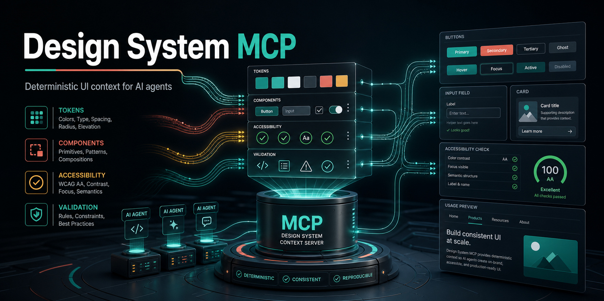
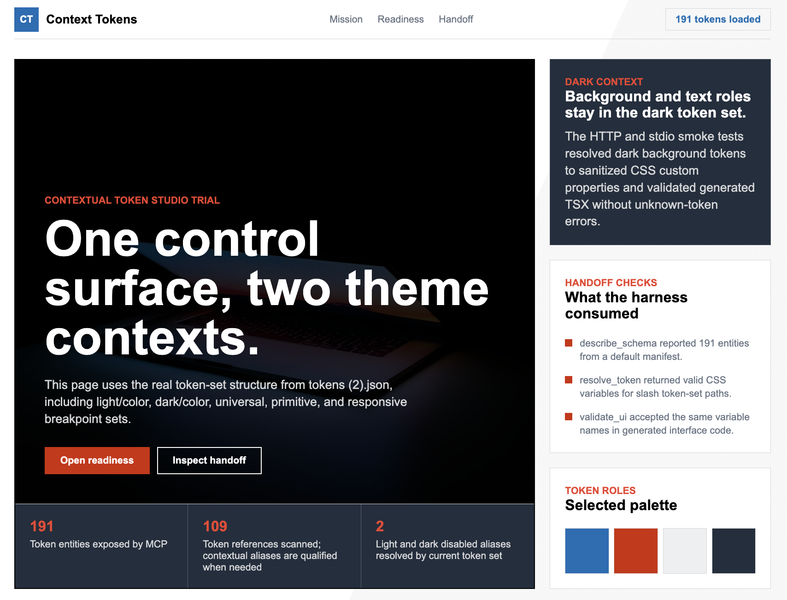

# Design System MCP Server

A single-instance [Model Context Protocol](https://modelcontextprotocol.io/) server that gives AI coding agents authoritative design-system context before they generate UI.

It indexes a design-system Git repository containing tokens, principles, patterns, voice/tone guidance, prompt templates, and validation rules. MCP-compatible IDEs, editors, and internal agents can then ask questions like:

- Which design tokens should I use for this button?
- What confirmation-dialog pattern exists?
- What voice and tone should this empty state use?
- Does this generated UI contain raw hex colors or other rule violations?

## Why This Exists

AI coding agents often generate UI without knowing your design system. They hard-code colors, invent spacing, miss patterns, and write off-voice copy. This server gives those agents a first-class, current, machine-readable source of truth.

## Real Output Examples

These are generated trial pages from real token and handoff sources, not marketing mockups.

| Example | Source compatibility proven |
| --- | --- |
| `examples/bmw-m-real-page` | Community Markdown / `getdesign.md`-style design-system handoff |
| `examples/material-3-token-page` | Material-style `tokens.json` export |
| `examples/dtcg-token-alias-page` | DTCG whole-token alias `.@` references |
| `examples/token-set-context-page` | Token Studio token sets with slash-containing names and context-local aliases |

**Community Markdown / getdesign handoff trial**


**Token Studio contextual token-set trial**



**Material 3 token export trial**


## Current Status

Implemented:

- Local source mode from a checked-out design-system repo
- Git source mode with clone/pull refresh
- stdio transport for local IDE use
- Streamable HTTP transport for hosted use
- In-memory bundle and MiniSearch index
- Style Dictionary token loading
- Community Markdown / `getdesign.md` token loading for Markdown-only or hybrid handoff repos
- Token Studio export compatibility, including contextual token-set references
- DTCG whole-token alias compatibility for trailing `.@` references
- Markdown and MDX content loading
- Prompt template loading
- JSON regex validation rules
- AST-backed JSX prop-value validation rules
- Component metadata ingestion from `components/*/component.json`
- TypeScript component API parser for `*Props` interfaces and type literals
- Storybook CSF story parser for canonical examples, variants, controls, and play-function interaction notes
- Canonical usage examples, constraints, and prop metadata
- Composition recommendation and composition/prop validation
- Deterministic decision explanations, recommendation provenance, violation provenance, and repair payloads where a single safe edit is known
- Built-in semantic token, accessibility, copy/voice, deprecated token, and deprecated component checks
- Optional HTTP API-key auth
- Health, readiness, version, and admin refresh endpoints
- MCP prompts registered from the loaded source repo (`prompts/*.prompt.md`)
- MCP resources for `design://manifest`, `design://schema`, `design://entity/{id}`, plus per-type templates `design://principle/{id}`, `design://pattern/{id}`, `design://component/{id}`, `design://prompt/{name}`
- Operator runbook (`docs/runbook.md`), client setup guide (`docs/client-setup.md`), sample Fly + Kubernetes deployment manifests under `deploy/`
- Performance baseline gates in CI (`tests/integration/perf-baseline.test.ts`)
- CI-friendly validation CLI (`pnpm validate -- --source <design-system-repo> <file...>`) with JSON/SARIF output, composition-plan validation, and nonzero exit on error violations
- Machine-readable workflow contract at `design://workflow` for design-system-first agent harnesses

## Design Principles

This project intentionally stays small.

- Single Node.js process
- No Redis
- No database
- No object store
- No bundle publishing pipeline
- No multi-instance coordination
- Source of truth is the design-system Git repo
- Hot state is an in-memory bundle rebuilt on startup and refresh

If you need horizontal scaling, persistent user state, OAuth, or external search, treat that as a separate future proposal rather than quietly adding it here.

## Architecture

```text
Design-system Git repo
  tokens/*.tokens.json
  docs/principles/*.md
  docs/patterns/*.md
  docs/conventions/*.md
  docs/voice-and-tone.md
  components/
    Button/
      component.json
      Button.tsx
      Button.stories.tsx
  prompts/*.prompt.md
  rules/*.json
  manifest.json
        |
        | clone/pull or local path
        v
Single Node.js MCP server
  Style Dictionary token resolution
  Markdown/frontmatter parsing
  JSON rule loading
  MiniSearch index
  In-memory bundle
        |
        | stdio or Streamable HTTP
        v
AI coding agents
```

## Prerequisites

- Node.js 22.0.0 or newer (LTS recommended; matches `package.json` `engines.node`)
- pnpm 9.0.0 or newer (`engines.pnpm`)
- git 2.5+, if using `DS_MCP_SOURCE_MODE=git` (modern distros all qualify; we rely on `--branch`/`--single-branch`/`--depth 1`)

Recommended:

```bash
corepack enable
corepack prepare pnpm@9.12.0 --activate
```

In this workspace, Homebrew pnpm is known to work:

```bash
PATH=/opt/homebrew/bin:$PATH pnpm test
```

## Install

```bash
pnpm install
pnpm build
```

## Design-System Source Repo Format

The server reads a separate design-system content repo. A minimal source repo looks like this:

```text
design-system/
  manifest.json
  getdesign.md
  tokens/
    core.tokens.json
    semantic.tokens.json
  docs/
    principles/
      clarity.md
    patterns/
      confirmation-dialog.md
    conventions/
      forms.mdx
    voice-and-tone.md
  components/
    Button/
      component.json
      Button.tsx
      Button.stories.tsx
  prompts/
    build_with_design_system.prompt.md
  rules/
    no-hex-colors.json
```

### `manifest.json`

The manifest declares content types and relations. New content types belong here, not as new MCP tools.

```json
{
  "schemaVersion": "1.0.0",
  "schema": {
    "types": {
      "token": {
        "description": "Design token",
        "searchable": ["name", "summary", "tags", "$type"]
      },
      "principle": {
        "description": "Design principle",
        "searchable": ["title", "summary", "body", "tags"]
      },
      "pattern": {
        "description": "Reusable UI pattern",
        "searchable": ["title", "summary", "body", "tags"]
      }
    },
    "relations": {
      "follows_principle": { "from": "pattern", "to": "principle" }
    }
  }
}
```

### Tokens

Tokens use DTCG-style JSON and are resolved through Style Dictionary.

```json
{
  "color": {
    "blue": {
      "500": {
        "$value": "#2563EB",
        "$type": "color",
        "$description": "Brand blue 500"
      }
    },
    "action": {
      "primary": {
        "$value": "{color.blue.500}",
        "$type": "color",
        "$description": "Primary action color"
      }
    }
  }
}
```

Community Markdown can also define tokens in YAML frontmatter. Use `tokens:` for full DTCG-shaped token trees, or use top-level community sections when the design system is authored as a single Markdown file: `colors`, `spacing`, `rounded`, `radius`, `radii`, `typography`, and `components`. The server normalizes these sections to DTCG-shaped input, then feeds the result through Style Dictionary with any `tokens/*.tokens.json` files. This supports Markdown-only repos and hybrid token+Markdown repos while keeping `resolve_token`, `validate_ui`, and `validate_composition` deterministic.

```markdown
---
tokens:
  color:
    brand:
      primary:
        value: "#2563EB"
        type: color
        description: Primary brand action.
      primaryHover:
        value: "{color.brand.primary}"
        type: color
---

# Design System
```

Token tables in Markdown prose are searchable guidance only. For machine-readable token resolution, put token data in Markdown frontmatter `tokens:` or in `tokens/*.tokens.json`.

```markdown
---
colors:
  canvas: "#000000"
  on-dark: "#ffffff"
spacing:
  section: 96px
rounded:
  none: 0px
typography:
  display-xl:
    fontFamily: "BMWTypeNextLatin, sans-serif"
    fontSize: 80px
components:
  button-primary:
    backgroundColor: "{colors.canvas}"
    textColor: "{colors.on-dark}"
---

# Community Design System
```

For Markdown-only repositories that intentionally provide tokens plus prose but not full enterprise component/pattern metadata, call `inspect_coverage` with `profile: "community"`. The default `enterprise` profile still treats missing required entity types as errors.

Tokens Studio exports are also supported when saved under `tokens/*.tokens.json`. If a file contains token-set metadata and unqualified references such as `{color.primary.40}`, the loader rewrites those references before Style Dictionary resolves them. When the current token set owns the target, that local target wins; for example, `light/color.color.action.disabled` can resolve `{color.disabled}` to `{light/color.color.disabled}` while `dark/color.color.action.disabled` resolves the same reference to `{dark/color.color.disabled}`. If the current token set does not own the target, the loader falls back to the single token set that owns it globally, for example `{global.color.primary.40}`. Ambiguous targets that cannot be resolved by either rule remain Style Dictionary errors. The server does not replace Style Dictionary resolution; this is a compatibility shim for common Tokens Studio exports.

CSS platform output encodes non-alphanumeric token-path characters into valid, collision-resistant custom-property names. A token path like `light/color.color.action.primary.disabled` is returned as `var(--light_u002f_color-color-action-primary-disabled)`, and `validate_ui` checks that same encoded name. This keeps slash-containing token sets compatible with generated CSS while preserving the original token entity id.

DTCG whole-token aliases that include a trailing `.@` marker are normalized when the target token exists. For example, `{composite.border.thin.@}` is passed to Style Dictionary as `{composite.border.thin}`. Missing targets are not guessed; they remain Style Dictionary reference errors.

### Token Source Compatibility

| Source style | Supported | Notes |
| --- | --- | --- |
| DTCG JSON in `tokens/*.tokens.json` | yes | Resolved through Style Dictionary |
| Token Studio JSON exports | yes | Supports token-set order, contextual references, and slash-containing token-set names |
| DTCG whole-token aliases with `.@` | yes | Normalized only when the target token exists |
| Markdown frontmatter `tokens:` | yes | Full DTCG-shaped token trees |
| Markdown community sections | yes | `colors`, `spacing`, `rounded`, `radius`, `radii`, `typography`, and `components` |
| Markdown prose token tables | searchable only | Good for guidance, not deterministic token resolution |

Token-only sources can enforce deterministic token use and catch raw values, unknown CSS variables, deprecated tokens, accessibility issues, and copy issues. Full enterprise handoff still needs component metadata, pattern contracts, voice rules, and conventions beside the tokens.

### Markdown Docs

Docs use YAML frontmatter plus Markdown or MDX body:

```markdown
---
id: principle:clarity
type: principle
title: Clarity
summary: Be clear, not clever.
tags: [principle, accessibility]
---

# Clarity

Use plain language and obvious affordances.
```

Pattern docs can also include a machine-checkable `contract` in frontmatter. `validate_composition` enforces this before code generation.

MDX files are supported in `docs/principles`, `docs/patterns`, and `docs/conventions`. The loader keeps frontmatter and prose searchable while stripping imports, exports, and component-only JSX from the indexed body. It also extracts common handoff structure into `entity.data.structured` so agents do not need to parse prose themselves:

- `<DoDont doText="..." dontText="..." />` pairs become `structured.do` and `structured.dont`.
- `## Do`, `## Do not`, `## Accessibility`, and `## Migration` list sections become stable arrays.
- `## Props` Markdown tables become `structured.propTables` with normalized prop rows.

Community-published root docs are also supported for UX-to-dev handoff. Root files named `getdesign.md`, `design-system.md`, `design.md`, `styleguide.md`, or `guidelines.md` are loaded as `convention` entities by default; root Markdown/MDX files with frontmatter `id`, `type`, or `tokens` are loaded too. This makes public/community formats searchable without adding content-specific MCP tools.

Docs and metadata may also reference entity ids directly, such as `component:button` or `token:color.action.primary`. The bundle infers deterministic `references` relations from those explicit ids, so `get_related` can walk the graph even when frontmatter did not include a manual `related` entry.

```yaml
contract:
  requiredComponents:
    - component:button
  requiredTokens:
    - token:color.action.danger
  requiredPrinciples:
    - principle:clarity
  componentOrder:
    - component:card
    - component:button
  propRequirements:
    - component: component:button
      prop: variant
      equals: danger
      severity: error
      message: Confirmation dialog confirm action must use the danger button variant.
  parentChildRules:
    - parent: component:card
      child: component:button
      relationship: required
      severity: error
      message: Confirmation action must be nested inside the dialog container.
  platformRequirements:
    - platform: web
      framework: react
      requiredComponents:
        - component:card
      forbiddenComponents:
        - component:button-group
      requiredTokens:
        - token:color.surface.default
  slots:
    - name: confirm-action
      required: true
      component: component:button
  constraints:
    - id: confirmation-specific-copy
      severity: warning
      message: Confirmation copy must name the object and irreversible action.
```

### Prompt Templates

Prompt files live under `prompts/*.prompt.md`:

```markdown
---
name: build_with_design_system
description: Build UI using this design system
arguments:
  - name: component_type
    required: true
---

Build a {{component_type}} using the design system.
```

### Component Metadata

Component metadata lives in `components/<ComponentName>/component.json`. This gives agents stable imports, prop contracts, canonical examples, constraints, and relationships without requiring the MCP server to generate application code.

When TypeScript source files are present beside `component.json`, the loader also reads the first matching `*Props` interface or type literal, preferring `<ComponentName>Props`. Extracted props include names, types, required flags, string-union values, JSDoc descriptions, `@default`, `@deprecated`, replacement hints, and simple controlled-state hints. Extracted props are merged into the metadata. Hand-authored `component.json` values win when both sources define the same prop.

When Storybook CSF files such as `Card.stories.tsx` are present, object stories with literal `args` are converted into additional usage examples. The parser also carries literal `argTypes.options` as controls and stores `play` functions as interaction notes. This keeps `get_usage` aligned with existing component examples without executing Storybook.

```json
{
  "id": "component:button",
  "type": "component",
  "name": "Button",
  "summary": "Action trigger for primary, secondary, and destructive user actions.",
  "package": "@acme/ui",
  "importPath": "@acme/ui/button",
  "dependencies": [
    {
      "package": "@acme/ui",
      "version": "^2.0.0",
      "type": "runtime",
      "reason": "Provides the Button component implementation."
    }
  ],
  "importGuidance": {
    "named": ["Button"],
    "sideEffects": [],
    "notes": ["Import Button from @acme/ui/button; do not deep-import internal files."]
  },
  "status": "stable",
  "replacedBy": [],
  "tags": ["action", "form"],
  "props": [
    {
      "name": "variant",
      "type": "\"primary\" | \"secondary\" | \"danger\"",
      "required": true,
      "values": ["primary", "secondary", "danger"],
      "description": "Visual intent. Use danger only for destructive actions."
    }
  ],
  "examples": [
    {
      "name": "Destructive confirm action",
      "language": "tsx",
      "code": "import { Button } from \"@acme/ui/button\";\n\n<Button variant=\"danger\">Delete project</Button>"
    }
  ],
  "constraints": [
    {
      "id": "button-specific-label",
      "severity": "error",
      "message": "Button labels must name the action and object."
    }
  ],
  "tokens": ["token:color.action.primary"],
  "principles": ["principle:clarity"],
  "patterns": ["pattern:confirmation-dialog"],
  "related": []
}
```

Deprecated components can declare migration chains:

```json
{
  "id": "component:legacy-button",
  "status": "deprecated",
  "replacedBy": ["component:button"],
  "migration": {
    "steps": [
      "Replace LegacyButton imports with Button imports.",
      "Map intent=\"danger\" to variant=\"danger\"."
    ],
    "examples": [
      {
        "name": "LegacyButton to Button",
        "language": "tsx",
        "code": "<Button variant=\"danger\">Delete project</Button>"
      }
    ]
  }
}
```

`validate_composition` treats deprecated components as error-severity legacy usage and suggests replacement component ids when declared. `inspect_coverage` reports stale `replacedBy` targets.

Example source-enriched props:

```tsx
export interface CardProps {
  /** Short heading shown at the top of the card. */
  title: string;
  /** Visual tone for the card container. */
  tone?: "neutral" | "accent" | "danger";
}
```

### Validation Rules

Rules live under `rules/*.json`. Source repos can define regex detectors for simple text checks and AST-backed JSX prop value detectors for component API constraints.

```json
{
  "id": "no-hex-colors",
  "description": "Raw hex colors must use design tokens",
  "severity": "error",
  "appliesTo": ["tsx", "jsx", "ts", "js", "css"],
  "detector": {
    "type": "regex",
    "pattern": "#[0-9a-fA-F]{3,8}\\b",
    "message": "Raw hex color {match} - use a color token instead"
  }
}
```

Invalid JSON, schema-invalid rules, duplicate rule IDs, invalid regex patterns, and invalid regex flags are skipped with structured warnings.

```json
{
  "id": "no-button-ghost-variant",
  "description": "Button variant must be one of the design-system variants.",
  "severity": "error",
  "appliesTo": ["tsx", "jsx"],
  "detector": {
    "type": "jsx-prop-value",
    "component": "Button",
    "prop": "variant",
    "disallow": ["ghost"],
    "message": "Button variant '{value}' is not in the design system."
  }
}
```

## Configuration

All configuration is read from environment variables and validated at boot.

| Variable | Default | Required | Description |
| --- | --- | --- | --- |
| `DS_MCP_MODE` | `http` | no | `stdio` or `http` |
| `DS_MCP_SOURCE_MODE` | `git` | no | `local` or `git` |
| `DS_MCP_SOURCE_PATH` | none | when local | Local design-system checkout |
| `DS_MCP_SOURCE_URL` | none | when git | HTTPS URL for the design-system repo |
| `DS_MCP_SOURCE_BRANCH` | `main` | no | Branch to track |
| `DS_MCP_CACHE_DIR` | `~/.cache/ds-mcp` | no | Git clone cache directory |
| `DS_MCP_REFRESH_INTERVAL_SEC` | `300` | no | Background refresh interval, minimum 30 |
| `PORT` | `3000` | no | HTTP listen port |
| `LOG_LEVEL` | `info` | no | `trace`, `debug`, `info`, `warn`, `error`, or `fatal` |
| `DS_MCP_AUTH_MODE` | `none` | no | `none` or `apikey` |
| `DS_MCP_API_KEYS` | none | when apikey | Comma-separated SHA-256 hex digests |
| `DS_MCP_ADMIN_TOKEN` | none | for admin refresh | Bearer token for `/admin/refresh` |
| `GIT_AUTH_TOKEN` | none | no | Token used for private HTTPS Git clone/pull |

See [.env.example](./.env.example).

## Run Locally With stdio

Use stdio mode for IDEs that spawn local MCP servers.

```bash
pnpm build

DS_MCP_MODE=stdio \
DS_MCP_SOURCE_MODE=local \
DS_MCP_SOURCE_PATH=/absolute/path/to/design-system \
node dist/index.js
```

Example MCP client command:

```json
{
  "mcpServers": {
    "design-system": {
      "command": "node",
      "args": ["/absolute/path/to/design-system-mcp/dist/index.js"],
      "env": {
        "DS_MCP_MODE": "stdio",
        "DS_MCP_SOURCE_MODE": "local",
        "DS_MCP_SOURCE_PATH": "/absolute/path/to/design-system"
      }
    }
  }
}
```

## Run Locally With HTTP

HTTP mode exposes Streamable HTTP MCP at `/mcp`.

```bash
DS_MCP_MODE=http \
DS_MCP_SOURCE_MODE=local \
DS_MCP_SOURCE_PATH=/absolute/path/to/design-system \
PORT=3000 \
pnpm dev
```

Useful endpoints:

```bash
curl http://localhost:3000/healthz
curl http://localhost:3000/readyz
curl http://localhost:3000/version
```

## Run From a Git Source

```bash
DS_MCP_MODE=http \
DS_MCP_SOURCE_MODE=git \
DS_MCP_SOURCE_URL=https://github.com/your-org/design-system.git \
DS_MCP_SOURCE_BRANCH=main \
PORT=3000 \
pnpm dev
```

The server clones the source repo into `DS_MCP_CACHE_DIR`, pulls periodically, and atomically swaps in a rebuilt bundle when content changes.

For private HTTPS repositories, set `GIT_AUTH_TOKEN`. The token is injected into Git operations and redacted from logs.

## API Key Auth

HTTP auth is optional. When enabled, clients must send:

```text
Authorization: Bearer <api-key>
```

Create a high-entropy key:

```bash
openssl rand -base64 32
```

Store only its SHA-256 hex digest in `DS_MCP_API_KEYS`:

```bash
printf '%s' 'your-api-key-here' | shasum -a 256 | awk '{print $1}'
```

Run with auth:

```bash
DS_MCP_MODE=http \
DS_MCP_AUTH_MODE=apikey \
DS_MCP_API_KEYS=<sha256-hex-digest> \
DS_MCP_SOURCE_MODE=local \
DS_MCP_SOURCE_PATH=/absolute/path/to/design-system \
pnpm dev
```

## Admin Refresh

Set `DS_MCP_ADMIN_TOKEN` to enable manual refresh:

```bash
curl -X POST http://localhost:3000/admin/refresh \
  -H "Authorization: Bearer $DS_MCP_ADMIN_TOKEN"
```

During graceful drain, `/readyz`, `/mcp`, and `/admin/refresh` return `503`. `/healthz` remains `200` while the process is alive.

## MCP Tools

The server exposes generic verbs:

| Tool | Purpose |
| --- | --- |
| `describe_schema` | Show content types, relations, and bundle metadata |
| `search_design_system` | Search tokens, docs, patterns, voice, and prompts |
| `get_entity` | Fetch one entity by ID |
| `list_entities` | Page through entities by type or tag |
| `get_related` | Fetch related entities |
| `resolve_token` | Find tokens and return platform-formatted values |
| `validate_ui` | Validate generated code against source-repo rules |
| `get_usage` | Return canonical imports, examples, props, and constraints |
| `recommend_composition` | Return an implementation brief for a UI intent |
| `validate_composition` | Validate planned components, props, patterns, and tokens before coding |
| `inspect_coverage` | Report content coverage gaps before deterministic generation |
| `explain_decision` | Explain a chosen entity with deterministic source, relation, and constraint evidence |

## Design-System-First Handoff Flow

For best UX-to-dev consistency, agents and CI should follow this sequence:

1. Read `design://workflow` or call `describe_schema`.
2. Call `inspect_coverage` to understand whether the source is enterprise-complete or token-only/community-grade.
3. Call `recommend_composition` with the UI intent.
4. Call `explain_decision` for selected components, patterns, or tokens when the harness needs auditable reasoning.
5. Call `get_usage` for selected components and `resolve_token` for every concrete token value.
6. Call `validate_composition` before generating code.
7. Generate code.
8. Call `validate_ui` and apply deterministic `repair` / `replaceWith` edits first.
9. In CI or final harness mode, run `pnpm validate -- --mode final_check --composition composition.json <file...>`.

The server publishes the workflow contract at `design://workflow`; hard blocking is enforced by the validation CLI and by any client harness that honors that resource.

Example `validate_ui` request:

```json
{
  "code": "const color = '#2563EB';",
  "language": "tsx",
  "rules": ["no-hex-colors"]
}
```

`validate_ui` also runs built-in semantic token, accessibility, and copy/voice checks:

- `no-raw-length-values` blocks raw `px`, `rem`, and `em` values.
- `no-raw-color-functions` blocks raw `rgb()`, `rgba()`, `hsl()`, and `hsla()` values.
- `no-unknown-css-vars` blocks token-like CSS variables that do not resolve to known design tokens.
- `prefer-semantic-tokens` warns when app code uses primitive tokens instead of semantic aliases.
- `no-deprecated-tokens` blocks deprecated token aliases and suggests replacements when declared.
- `a11y-img-alt` requires images to have alt text or another accessible name.
- `a11y-button-name` requires buttons to have visible text or an accessible name.
- `a11y-link-name` requires links to have visible text or an accessible name.
- `a11y-form-control-label` requires inputs, selects, and textareas to have labels or accessible names.
- `a11y-no-positive-tabindex` blocks positive tab order overrides.
- `a11y-no-autofocus` warns when markup uses autofocus.
- `a11y-valid-aria-role` blocks invalid ARIA role names.
- `copy-no-blame` blocks copy that blames the user.
- `copy-no-hype` warns on hype, alarmism, and exclamation marks.
- `copy-no-vague-actions` warns on vague action labels such as "Submit" or "Process".
- `copy-no-destructive-hedging` warns when destructive copy uses hedging language.

When a violation has one deterministic edit, the response includes `replaceWith` and a structured `repair` payload:

```json
{
  "ruleId": "no-deprecated-tokens",
  "match": "var(--color-action-legacyPrimary)",
  "replaceWith": "var(--color-action-primary)",
  "repair": {
    "operation": "replace",
    "before": "var(--color-action-legacyPrimary)",
    "after": "var(--color-action-primary)"
  }
}
```

Rules that require product judgment still return human-readable `suggestion` text without an auto-fix.

Example response:

```json
{
  "ok": false,
  "violations": [
    {
      "ruleId": "no-hex-colors",
      "severity": "error",
      "message": "Raw hex color #2563EB - use a color token instead",
      "line": 1,
      "column": 16,
      "match": "#2563EB",
      "provenance": {
        "ruleSource": "source-repo",
        "rulePath": "rules/no-hex-colors.json"
      }
    }
  ],
  "ranRules": ["no-hex-colors"],
  "bundleVersion": "nogit-2026-05-01T16:40:00.000Z"
}
```

## Docker

Build:

```bash
docker build -t ds-mcp-server .
```

Run against a local source checkout:

```bash
docker run --rm -p 3000:3000 \
  -e DS_MCP_MODE=http \
  -e DS_MCP_SOURCE_MODE=local \
  -e DS_MCP_SOURCE_PATH=/design-system \
  -v /absolute/path/to/design-system:/design-system:ro \
  ds-mcp-server
```

Use `docker-compose.yml` as a starting point for local hosted-mode testing.

## Development

```bash
pnpm install
pnpm lint
pnpm typecheck
pnpm test
pnpm build
```

Run only unit or integration tests:

```bash
pnpm test:unit
pnpm test:integration
```

Validate changed UI files against a local design-system source repo in CI:

```bash
pnpm validate -- --source ./path/to/design-system src/App.tsx
pnpm validate -- --source ./path/to/design-system --format sarif src/App.tsx > ds-results.sarif
pnpm validate -- --source ./path/to/design-system --composition composition.json
pnpm validate -- --source ./path/to/design-system --mode final_check --composition composition.json src/App.tsx
```

The command prints JSON or SARIF and exits `1` if any error-severity `validate_ui` / `validate_composition` violation is found. In `--mode final_check`, it also exits `1` when required harness evidence is missing, such as running UI validation without a composition plan.

This project follows test-first development for non-trivial changes. Add focused tests first, implement the smallest safe change, then run the relevant verification before committing.

## Repository Layout

```text
src/
  auth/              API-key validation
  bundle/            Manifest, token, markdown, prompt, and rule loading
  observability/     Pino logger
  search/            MiniSearch index
  server/            MCP server wiring and shared types
  source/            Local and Git source adapters
  tools/             MCP tool handlers
  transport/         stdio and Streamable HTTP transports
  util/              Small shared utilities
  validation/        validate_ui detector helpers
tests/
  fixtures/          Sample design-system repo
  integration/       End-to-end tool/transport tests
  unit/              Unit tests
```

## Contributing

Before opening a pull request:

1. Keep the single-instance architecture intact.
2. Do not add Redis, a database, object storage, queues, or multi-instance coordination.
3. Add or update tests before changing behavior.
4. Run:

```bash
pnpm lint
pnpm typecheck
pnpm test
pnpm build
```

## Security

- Do not commit `.env` files, deploy keys, API keys, or admin tokens.
- Use high-entropy API keys and store only SHA-256 hex digests.
- Logs redact common secret/header fields.
- The MCP surface is read-only. Authoring stays in the design-system Git repo.

## License

MIT. See [LICENSE](./LICENSE).
